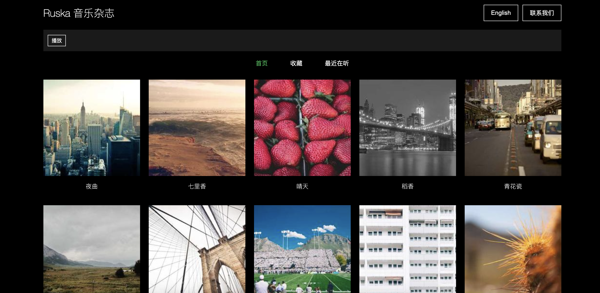

# Ruska 音乐杂志

## 项目介绍

Ruska 音乐杂志是一个开源的网页版音乐播放器项目，旨在为音乐爱好者提供一个简洁、美观的音乐欣赏平台。我们的使命是"寻找世界好音乐"，希望通过这个项目，让更多人发现并分享优质的音乐作品。

Demo网址：https://vermillion-zabaione-90f3be.netlify.app/

## 目录结构

```
music-magazine/
│
├── index.html          # 主页面 HTML 文件
├── style.css           # 样式表文件
├── main.js             # 主要 JavaScript 文件
├── package.json        # 项目配置文件
├── package-lock.json   # 依赖版本锁定文件
└── README.md           # 项目说明文档
```

## 文件功能

- `index.html`: 定义了网页的基本结构，包括头部、播放器、标签切换器和音乐网格。
- `style.css`: 包含了整个应用的样式定义，实现了简约的 MUJI 风格设计。
- `main.js`: 包含了所有的交互逻辑，如音乐播放、收藏、语言切换等功能。
- `package.json`: 定义了项目的依赖和脚本命令。

## 功能介绍

1. 音乐播放：用户可以点击音乐项来播放/暂停音乐。
2. 收藏功能：用户可以收藏喜欢的音乐，方便后续查找。
3. 最近播放：记录用户最近播放的音乐。
4. 语言切换：支持中英文界面切换。
5. 响应式设计：适配不同尺寸的屏幕。

## 如何贡献

我们欢迎并鼓励大家为这个开源音乐杂志项目做出贡献！无论您是开发者、设计师、音乐爱好者还是内容创作者，都可以通过以下方式参与：

1. 提交 bug 报告或功能建议
2. 改进代码或添加新功能
3. 优化用户界面和用户体验
4. 推荐优质音乐，丰富音乐库
5. 撰写或翻译项目文档

如果您对这个项目感兴趣，请不要犹豫，立即加入我们的开源社区！让我们一起打造一个令人惊叹的音乐分享平台，为全世界的音乐爱好者带来美好的聆听体验。

## 联系我们

如果您有任何问题、建议或想法，欢迎通过以下方式与我们联系：

- 在 GitHub 上提交 Issue
- 发送邮件至：[jqlong@foxmail.com]

让我们携手共创一个充满音乐魅力的世界！

---
以上内容均为AI自动生成，请以实际情况为准。